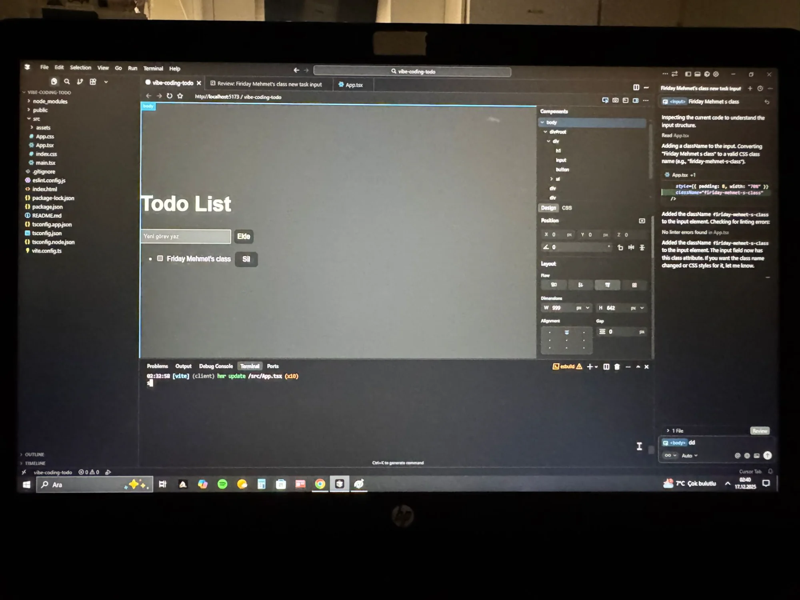

# 🚀 Vibe Coding Project: Todo List Application



This project is a functional Todo List application featuring task persistence via Local Storage, developed primarily using the **Cursor** AI-first code editor.

## ✨ Key Features

* Add new tasks
* Mark tasks as completed
* Delete tasks
* Persistence of tasks using Browser Local Storage
* Clean and intuitive user interface

## 🛠️ Technologies Used

| Layer | Technology |
| :--- | :--- |
| **Vibe Coding Tool** | Cursor |
| **Frontend** | React |
| **Programming Language** | TypeScript |
| **Data Persistence** | Local Storage |
| **Build Tool** | Create React App |
| **Containerization** | Docker & Docker Compose |
| **Web Server** | Nginx (Alpine) |

## 📂 Setup and Running the Project

### Prerequisites

* **For Local Development:**
  * Node.js (v16 or higher recommended)
  * npm or yarn
* **For Docker:**
  * Docker installed on your system
  * Docker Compose (optional, but recommended)

### Option 1: Run with Docker (Recommended for Production)

#### Using Docker Compose (Easiest)

1.  **Clone the Repository:**
    ```bash
    git clone https://github.com/ozalp44/-zalp-zel22051350172vibe-coding-todo.git
    cd -zalp-zel22051350172vibe-coding-todo
    ```

2.  **Build and Run with Docker Compose:**
    ```bash
    docker-compose up -d
    ```

3.  **Open in Browser:**
    Navigate to `http://localhost:3000`

4.  **Stop the Container:**
    ```bash
    docker-compose down
    ```

#### Using Docker Commands

1.  **Clone the Repository:**
    ```bash
    git clone https://github.com/ozalp44/-zalp-zel22051350172vibe-coding-todo.git
    cd -zalp-zel22051350172vibe-coding-todo
    ```

2.  **Build the Docker Image:**
    ```bash
    docker build -t vibe-coding-todo:latest .
    ```

3.  **Run the Container:**
    ```bash
    docker run -d -p 3000:80 --name todo-app vibe-coding-todo:latest
    ```

4.  **Open in Browser:**
    Navigate to `http://localhost:3000`

5.  **View Container Logs:**
    ```bash
    docker logs todo-app
    ```

6.  **Stop and Remove Container:**
    ```bash
    docker stop todo-app
    docker rm todo-app
    ```

### Option 2: Run Locally (Development)

1.  **Clone the Repository:**
    ```bash
    git clone https://github.com/ozalp44/-zalp-zel22051350172vibe-coding-todo.git
    cd -zalp-zel22051350172vibe-coding-todo
    ```

2.  **Install Dependencies:**
    ```bash
    npm install
    # or
    yarn install
    ```

3.  **Start the Development Server:**
    ```bash
    npm start
    # or
    yarn start
    ```

4.  **Open in Browser:**
    The application will automatically open at `http://localhost:3000`

## 📝 Project Structure

```
vibe-coding-todo/
├── src/
│   ├── App.tsx          # Main application component
│   ├── index.tsx        # Entry point
│   └── index.css        # Global styles
├── public/
│   └── index.html       # HTML template
├── README.md            # Project documentation
├── EXPERIENCE.md        # Development experience documentation
├── ANALYSIS.md          # Comparative analysis of vibe coding tools
├── package.json         # Project dependencies
├── tsconfig.json        # TypeScript configuration
├── Dockerfile           # Docker configuration for containerization
├── docker-compose.yml   # Docker Compose configuration
├── .dockerignore        # Files to exclude from Docker build
└── .gitignore          # Git ignore file
```

## 🎯 How to Use

1. Type your task in the input field
2. Click "Add" button or press Enter to add the task
3. Click the checkbox to mark a task as completed
4. Click "Delete" button to remove a task
5. Your tasks are automatically saved and will persist even after closing the browser

## 📄 License

This project is open source and available under the [MIT License](LICENSE).

## 🙏 Credits and Acknowledgments

* **Cursor AI** - Primary development tool used for this project
* **React Team** - For the amazing React framework
* **Create React App** - For the project boilerplate
* **Course Instructor** - For the assignment guidance and vibe coding exploration opportunity

## 📚 Related Documentation

* [EXPERIENCE.md](EXPERIENCE.md) - Detailed development experience with Cursor
* [ANALYSIS.md](ANALYSIS.md) - Comparative analysis of vibe coding tools

---

**Note:** This project was created as part of a vibe coding exploration assignment. The goal was to experience and document the use of AI-powered development tools in a real-world project scenario.
